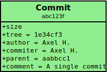
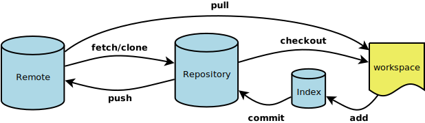

GIT Illustrated Cheatsheet
**************************

.. toctree::
   :maxdepth: 2

GIT Model
=========

   

Object & SHA1
-------------

- Each object has a **type**, a **size** and a **content**
- Each object is identified by a 40-digit SHA1 hash of attributes
   - 6ff87c4664981e4397625791c8ea3bbb5f2279a3
- Each SHA1 can be shortened to the first digits
   - 6ff87c4664981e4397625
   - 6ff87c4
- Object type can be **blob**, **tree**, **commit** or **tag**

Blob
----

- Used to store file data
- Same content = same SHA1 = same blob
- See it as a file

Tree
----

- Associate names to blobs and other trees
- See it as a directory

Commit
------

- Used to snapshot a tree state
- Has **tree**, **parent(s)**, **author**, **commiter** and **comment** attributes
- Not the same as SVN ones:
   - SVN store diffs
   - GIT store full state

Tags
----

- Reference an object
- Has **object**, **type**, **tagger** and **comment** attributes.
- Not used for lightweight tags
   - Simple pointer on a commit (like branches)

Branch
------

- A branch is simply a pointer to a certain commit.
- A branch is not aa GIT object (no SHA1)

Basic operations
================

Configuration
-------------

Set your name and email::

   $ git config --global core.name "Me"
   $ git config --global core.email "me@company.com"
   
Display your config::

   $ git config --global
   $ git config --local  # in a repository

Staging
-------

Stage your changes::

   # Add to index / stage
   $ git add file.txt
   
   # Add all modified and new files (tracked or not) to index
   $ git add -A
   
   # Partial staging
   $ git add -p file.txt
   

Commit
------

Create a commit into the current branch::

   # Commit from index
   $ git commit
   
   # Commit from tracked file list
   $ git commit file1.txt file2.txt
   
   # All modified tracked files
   $ git commit -a
   
   # Commit from pattern
   $ git commit **/*.py
   

See your repository
-------------------
See the current status::

   $ git status

Retrieve your history::

   # Log intégral
   $ git log
   
   # 5 dernier commits
   $ git log -5
   
   # Diff between two branches
   $ git log origin/master..master

Stash
-----

Discard your changes for later::

   # Create a stash 
   $ git stash
   
   # list stashes
   $ git stash list
   
   # Apply a stash
   $ git stash apply
   
   # Apply a stash and drop it
   $ git stash pop
   
   # Clear your stashes
   $ git stash clear   

Undoing
-------

Revert back changes::

   # Reverse commit
   $ git revert {SHA1}
   
   # Amend commit
   $ git commit --amend
   
   # Uncommit
   $ git reset --mixed HEAD file
   
   # Discard changes
   $ git checkout file
   
   # Reset branch to a given state
   $ git reset --hard ref

Branching and merging
=====================

Create a branch
---------------

::

   $ git branch feature     # Create the branch
   $ git checkout feature   # Switch to the new branch
   # or in a single command
   $ git checkout -b feature

.. figure:: diagrams/svg/git-branch-create.svg
   :height: 300px
   :align: center
   :class: centered
   
Branche diverging
-----------------

Branches diverge when they have different commits

   
   
Merge
-----

Create a merge commit and keep your branch history::

   $ git merge feature
   
.. figure:: diagrams/svg/git-branch-merge.svg
   :height: 350px
   :align: center
   :class: centered
   

Rebase
------

Re-apply your commits and keeps your history linear::

   $ git rebase master
   # or interactive version
   $ git rebase -i master
   
.. figure:: diagrams/svg/git-branch-rebase.svg
   :height: 350px
   :align: center
   :class: centered
   

Cherry Pick
-----------

Pick a commit an apply it in the current branch as a new commit::

   $ git cherry-pick {SHA1}

   
   
Working with remote repositories
================================

- It's only branches
- Repository synchronization operations::

   $ git fetch
   $ git push
   $ git pull  # fetch + merge
   $ git pull --rebase  # fetch + rebase

   
   
Add a remote
------------

::

   git remote add origin git://somewhere.git
   git fetch 

.. figure:: diagrams/svg/git-remote.svg
   :height: 350px
   :align: center
   :class: centered
   
   
Diverging with remote
---------------------

It's just more branches !

.. figure:: diagrams/svg/git-branch-diverge-remote.svg
   :height: 350px
   :align: center
   :class: centered
   

   
Sample workflows
================

TODO

~/.gitconfig
============

Tune your ``~/.gitconfig`` for comfort !

.. code-block:: ini

   [alias]
      st = status
      ci = commit
      co = checkout
      br = branch
      amend = commit --amend
      rlog = log --pretty=oneline --abbrev-commit --graph --decorate
      plog = log --graph --pretty=format:'%Cred%h%Creset -%C(yellow)%d%Creset %s %Cgreen(%cr) %C(bold blue)<%an>%Creset' --abbrev-commit --date=relative
      unadd = reset --mixed HEAD
      uncommit = reset --soft HEAD^
   [color]
      branch = auto
      diff = auto
      interactive = auto
      status = auto

Visual Tools
============

- Windows
   - `Tortoise GIT`_
   - `Git Extensions`_
- Mac OSX
   - `GitX`_
   - `Tower`_
- Linux
   - `gitg`_
   - `Giggle`_
- Multiplaform
   - `SmartGit`_

IDE Integration
===============

- *Eclipse*: `EGit`_
- *IntelliJ*: `Version Control Systems Integration`_
- *netbean*: `GIT Support`_

References
==========

- `Git Community Book`_
- `Pro GIT`_
- `Github documentation`_

.. _`Git Community Book`: http://book.git-scm.com/
.. _`Pro GIT`: http://progit.org/
.. _`Github documentation`: http://help.github.com/
.. _`Git Extensions`: http://code.google.com/p/gitextensions/
.. _`Tortoise GIT`: http://code.google.com/p/tortoisegit/
.. _`SmartGit`: http://www.syntevo.com/smartgit/index.html
.. _`GitX`: http://gitx.frim.nl/
.. _`Tower`: http://www.git-tower.com/
.. _`gitg`: http://git.gnome.org/browse/gitg/
.. _`giggle`: http://live.gnome.org/giggle
.. _`EGit`: http://www.eclipse.org/egit/
.. _`Version Control Systems Integration`: http://www.jetbrains.com/idea/features/version_control.html
.. _`GIT Support`: http://netbeans.org/kb/docs/ide/git.html
