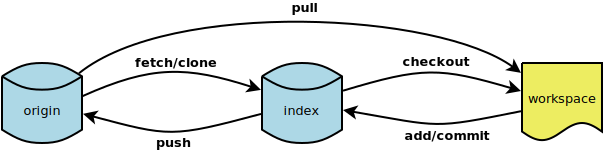
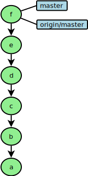
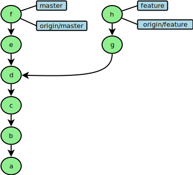
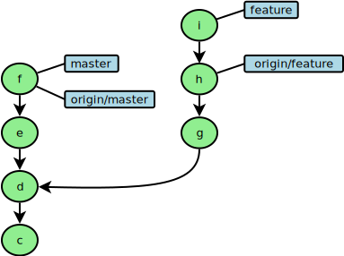

Working with remote repositories
================================

Working with remote repositories is basically the same as working with branches.

   
   GIT operations

   
   Local and remote branches
   

   
   Local and remote branches diverging
   

   
   Local and remote branches diverging